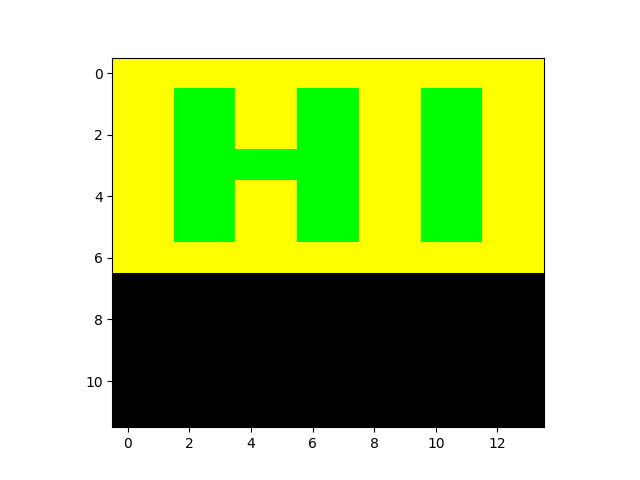
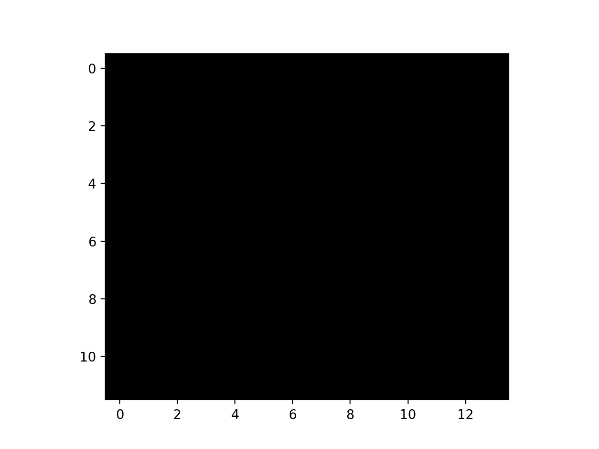

# Sixel Interpreter

Simple sixel interpreter to draw sixel images.

## Installation

```
poetry install
```

## Show sixel image

```
python -m sixel_interpreter.vis samples/hi.sixel
# or python -m sixel_interpreter.vis <samples/hi.sixel
```



## Show sixel drawing animation

```
python -m sixel_interpreter.vis --animation samples/hi.sixel
# or python -m sixel_interpreter.vis --animation <samples/hi.sixel
```



You can also specify frame interval with `--interval=<interval_ms>` option.
